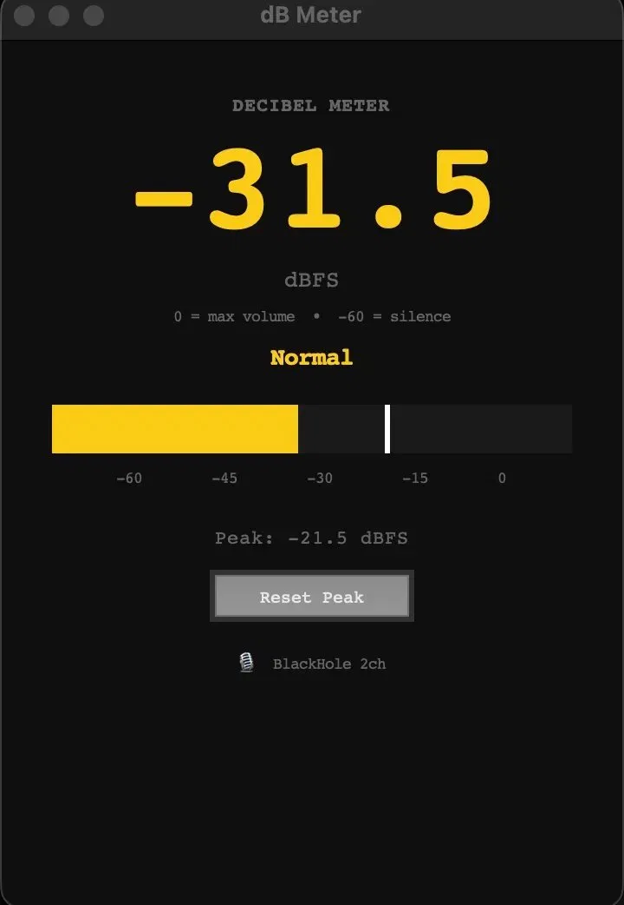

# Decibel Meter

A real-time desktop audio level monitor built with Python and Tkinter. Displays live dBFS readings, a color-coded level bar with peak hold, and automatic loudness classification.

## Screenshot



## Features

- Live dBFS (decibels relative to full scale) readout updated every 50ms
- Color-coded loudness levels — green, yellow, orange, and red
- Visual level bar with a peak hold indicator and manual reset
- Routes audio through BlackHole 2ch virtual audio device to monitor system output

## Tech Stack

- **Python 3** — application logic
- **Tkinter** — desktop GUI
- **sounddevice** — low-latency audio stream capture
- **numpy** — RMS-to-dBFS conversion

## Loudness Scale

| Range | Label | Color |
|---|---|---|
| Below -40 dBFS | Quiet | Green |
| -40 to -20 dBFS | Normal | Yellow |
| -20 to -10 dBFS | Loud | Orange |
| Above -10 dBFS | Very Loud | Red |

## Requirements

```bash
pip install sounddevice numpy
```

[BlackHole 2ch](https://existential.audio/blackhole/) virtual audio driver is required to route system audio for monitoring.

## How to Run

```bash
python main.py
```

## Project Structure

```
decibel-meter/
├── main.py      # Audio capture, dBFS conversion, and Tkinter UI
└── README.md
```
